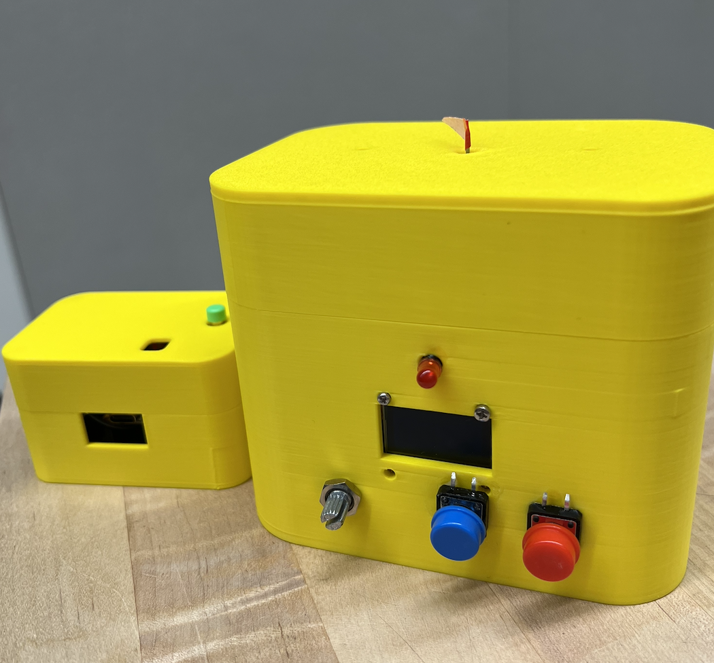
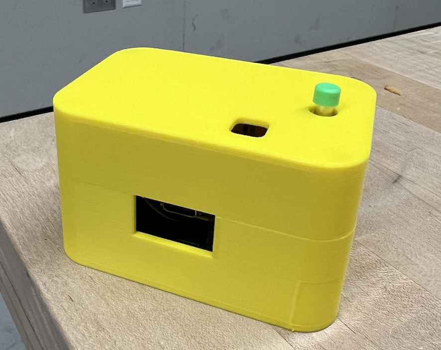
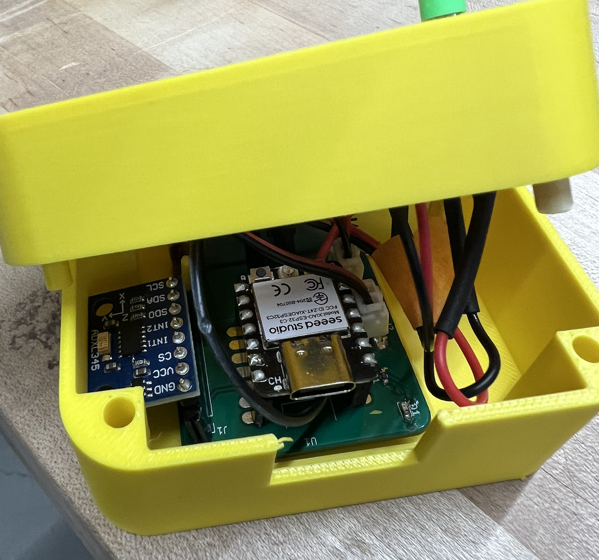
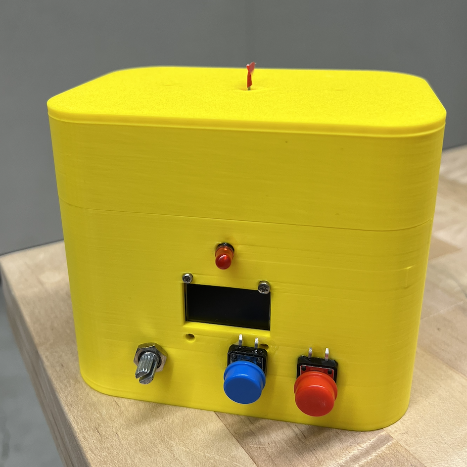
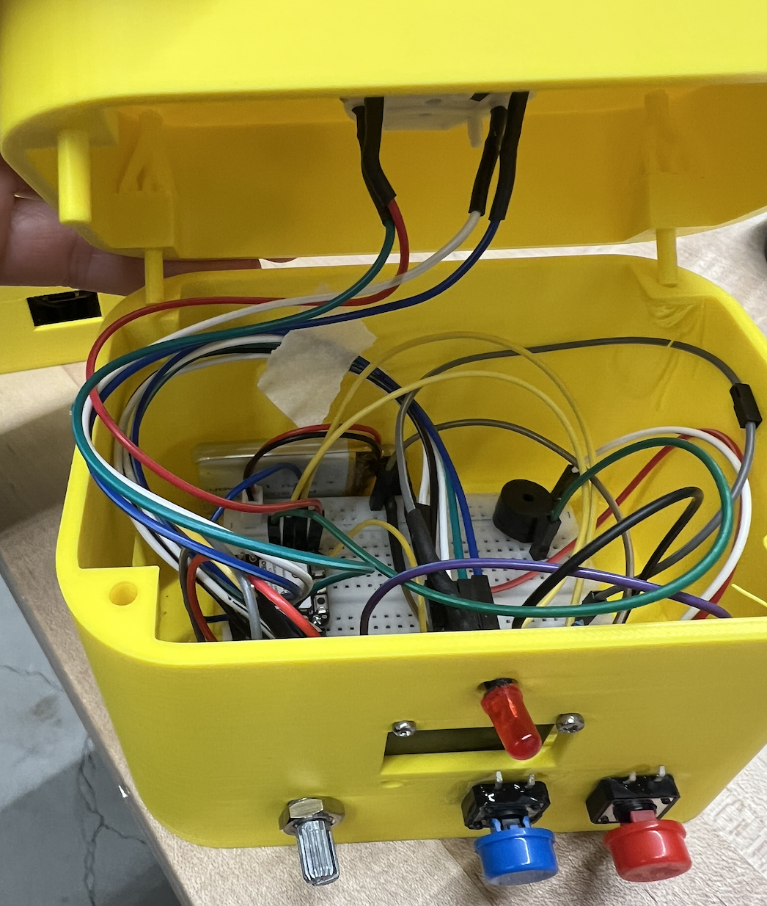

# TECHIN514_W26 Final Project
# Shake to Wake

> An alarm clock that **forces you out of bed** — the alarm won't stop until you've moved enough


---

## 📦 Repository Structure
 
```
smart-alarm-clock/
├── alarm_unit/                  # Bedside alarm unit firmware (XIAO ESP32-C3)
│   ├── src/main.cpp
│   └── platformio.ini
├── sensor_unit/                 # sensor firmware (XIAO ESP32-C3)
│   ├── src/main.cpp
│   └── platformio.ini
├── datasheet/                   # Component datasheets
│   ├── ADXL345.pdf
│   ├── LED.pdf
│   ├── Passive_Buzzer.pdf
│   ├── Potentiometer.pdf
│   ├── Push_button.pdf
│   ├── SSD1306.pdf
│   ├── Tactile_switch.pdf
│   └── X27.pdf
├── hardware/
│   ├── Files/                   # Source design files
│   │   ├── Disclosure/          # Disclosure documents
│   │   ├── PCB/                 # KiCad PCB layout files
│   │   ├── Schematic/           # KiCad schematic files
│   │   └── BOM.numbers          # Bill of Materials
│   └── Picture/                 # Rendered images
│       ├── BOM.png
│       ├── Display_3D.png
│       ├── Display_circuit.png
│       ├── Display_disclosure.png
│       ├── PCB layput.png
│       ├── Schematic.png
│       ├── Sensor_3D.png
│       ├── Sensor_circuit.png
│       └── Sensor_disclosure.png
└── README.md
```

---

## 🔧 Hardware Overview

### Device 1 — Motion Sensor

A  sensor device that detects motion and transmits data wirelessly to the bedside alarm unit via ESP-NOW.

| Component | Part | Notes |
|---|---|---|
| Microcontroller | Seeed Studio XIAO ESP32-C3 | ESP-NOW wireless TX |
| Accelerometer | ADXL345 3-axis | Motion detection via I²C |
| Battery | 3.7V 500mAh LiPo


**How it works:**
1. ADXL345 reads 3-axis acceleration every 100ms
2. Adaptive DSP pipeline processes raw data:
   - **Delta Magnitude** — L1-norm: `|ΔX| + |ΔY| + |ΔZ|`
   - **SMA Filter (N=10)** — 10-sample rolling average, removes sensor noise
   - **Baseline Calibration** — collects 10 samples at alarm start, computes `threshold = μ + 3σ`
   - **Adaptive Threshold** — auto-calibrated per device and orientation
3. Broadcasts motion packet to alarm unit via ESP-NOW every 100ms





**Power:**
- 3.7V 500mAh LiPo → ~17h full-active but It will be used only 1 times per day and around 1-3 min. So It can last longer than one week.

---

### Device 2 — Bedside Alarm Unit

The bedside unit alerts the user at the scheduled time and tracks motion progress received from the sensor.

| Component | Part | Notes |
|---|---|---|
| Microcontroller | Seeed Studio XIAO ESP32-C3 | ESP-NOW receiver |
| Display | SSD1306 OLED 128×64 | I²C @ GPIO6(SDA) / GPIO7(SCL) |
| Gauge Motor | X27 / VID28-05 stepper | SwitecX25 library, 315° sweep |
| Buzzer | Passive piezo | Für Elise melody via LEDC PWM |
| LED | Single indicator | Blinks during alarm |
| Buttons | Tactile push button × 2 | ENTER (D9) / CANCEL (D8) |
| Potentiometer | B10K | Menu navigation |
| Power | USB-C 5V mains | Always-on bedside device |

**How it works:**
1. At scheduled alarm time: buzzer plays Für Elise, LED blinks, OLED shows `!! ALARM !!`
2. ESP-NOW initialises and connects to sensor
3. Sensor calibrates for 1 second → OLED shows `Calibrated!`
4. Motion detected → progress bar +10%, motor advances
5. X27 motor visually tracks progress (0° → 315° over 10 increments)
6. Alarm stops **only** when progress reaches 100%
7. Motor returns to 0°, ESP-NOW disconnects




**User Interaction:**
- ENTER: set clock / alarm time via potentiometer
- CANCEL: force-stop alarm (only after 50% progress)
- Alarm **cannot** be fully dismissed until motion condition is satisfied

---

## 📡 System Architecture

```
┌──────────────────────────┐              ┌──────────────────────────┐
│   ..... SENSOR           │              │   BEDSIDE ALARM UNIT     │
│   XIAO ESP32-C3          │   ESP-NOW    │   XIAO ESP32-C3          │
│                          │  2.4 GHz     │                          │
│  ADXL345 → DSP → TX ────┼─────────────►│  RX → Progress Logic    │
│                          │              │                          │
│  500mAh LiPo             │              │  OLED + X27 Motor        │
│  USB-C charge            │              │  Buzzer + LED + Buttons  │
│                          │              │  USB-C mains             │
└──────────────────────────┘              └──────────────────────────┘

Protocols: I²C (ADXL345, OLED) | GPIO (Motor, LED, Buzzer) | ADC (Pot)
```

---

## 🔄 Workflow

```
1. Alarm time reached
        │
        ▼
2. Buzzer (Für Elise) + LED blink + OLED "!! ALARM !!" activated
        │
        ▼
3. ESP-NOW starts → connects to  sensor
        │
        ▼
4. Calibrate baseline (~1s, hold still) → "Calibrated!" on OLED
        │
        ▼
5. User moves sensor
        │
   ┌────┴──────────────────────┐
   │  Motion detected?          │
   │  smoothMag > μ + 3σ        │
   └────┬──────────────────────┘
        │ YES                    NO → progress holds
        ▼
6. Progress +10%, motor advances ~31.5°
        │
        ▼
7. Progress = 100% (10 increments)
        │
        ▼
8. Alarm stops, motor returns to 0°, ESP-NOW disconnects
```

---

## 📐 DSP Signal Processing Pipeline

The sensor uses an **Adaptive DSP pipeline** — threshold self-calibrates at each alarm onset:

| Step | Technique | Detail |
|---|---|---|
| 1 | Read XYZ @ 100ms | ADXL345 → I²C → ESP32-C3 |
| 2 | Delta Magnitude | L1-norm: `\|ΔX\|+\|ΔY\|+\|ΔZ\|` |
| 3 | SMA Filter (N=10) | Rolling average — removes sensor noise |
| 4 | Baseline Calibration | 10 samples at boot → compute μ and σ |
| 5 | Adaptive Threshold | `threshold = μ + 3σ` (auto per-device) |
| 6 | Cooldown Gate | 500ms temporal filter — prevents double-count |

**Accuracy (50 trials):**
- True Positive Rate: **96.4%** (after adaptive calibration)
- False Positive Rate: **1.8%** (vs 5.8% with fixed threshold)
- Calibration time: **~1 second**

---

## 🔋 Power Considerations
 
### Sensor Unit — 3.7V 500mAh LiPo
 
| Parameter | Calculation | Value |
|---|---|---|
| Usage per day | Alarm time | 15 min (0.25h) |
| Standby time/day | 24h − 0.25h | 23.75h |
| Standby energy | 6.73 mW × 23.75h | 159.8 mWh |
| Alarm energy | 95.4 mW × 0.25h | 23.8 mWh |
| **Energy per day** | 159.8 + 23.8 | **183.6 mWh** |
| Battery needed (1 week) | 1,285 mWh ÷ (3.7 × 0.85) | 409 mAh |
| **Battery chosen** | Standard LiPo | **500 mAh ✅** |
| **Battery life** | 1,572 mWh ÷ 183.6 mWh/day | **~7.6 days** |
 
| Metric | Value |
|---|---|
| Active Draw (alarming) | ~25.8 mA |
| Sleep Draw (standby) | ~1.8 mA |
| Charging | USB-C, ~1h |
 

See more detail in [Battery Consideration](hardware/Files/ShakeToWake_BatterySizing.xlsx)

---

## 💰 Bill of Materials (Budgeting)

| Component | Qty | Unit | Total |
|---|---|---|---|
| XIAO ESP32-C3 | 2 | $7.00 | $14.00 |
| ADXL345 Module | 1 | $2.50 | $2.50 |
| SSD1306 OLED 0.96" | 1 | $3.50 | $3.50 |
| X27 / VID28-05 Motor | 1 | $4.00 | $4.00 |
| Passive Buzzer | 1 | $0.50 | $0.50 |
| LED + Resistors | — | $0.20 | $0.20 |
| Tactile Button × 2 | 2 | $0.30 | $0.60 |
| B10K Potentiometer | 1 | $0.40 | $0.40 |
| LiPo 500mAh (sensor) | 1 | $3.50 | $3.50 |
| **TOTAL** | | | **$30.20** |

---

## 🛠️ Setup & Flash

### Requirements
- [PlatformIO](https://platformio.org/) (VS Code extension)
- Board: `seeed_xiao_esp32c3`

### Flash Alarm Unit
```bash
cd alarm_unit
pio run --target upload
```

### Flash Sensor Unit
```bash
cd sensor_unit
# ⚠️ Update ALARM_UNIT_MAC[] in src/main.cpp with alarm unit's MAC address
# Find MAC: open Serial Monitor on alarm unit at 115200 baud after boot
pio run --target upload
```

---

## 🚀 Future Work

Making a small wearable sensor on the leg and it can detect when user are actually walking to confirm whether the user has woken up or not. Since now the sensor device is too big to be attached on the body
---

## 📋 Schematic & PCB Layout

- KiCad schematic: [`hardware/schematic/`](hardware/Files/Schematic/)
- PCB layout: [`hardware/pcb/`](hardware/Files/PCB/)

---

## 📚 Course Information

**Course:** TECHIN514 — Embedded Systems  
**Term:** Winter 2026 (W26)  
**Project:** Final Project